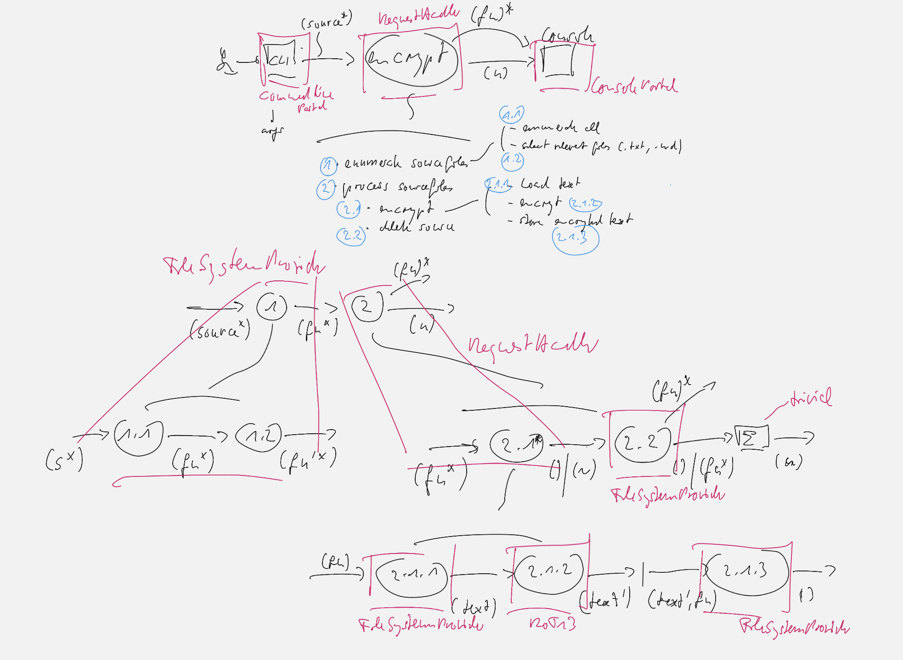
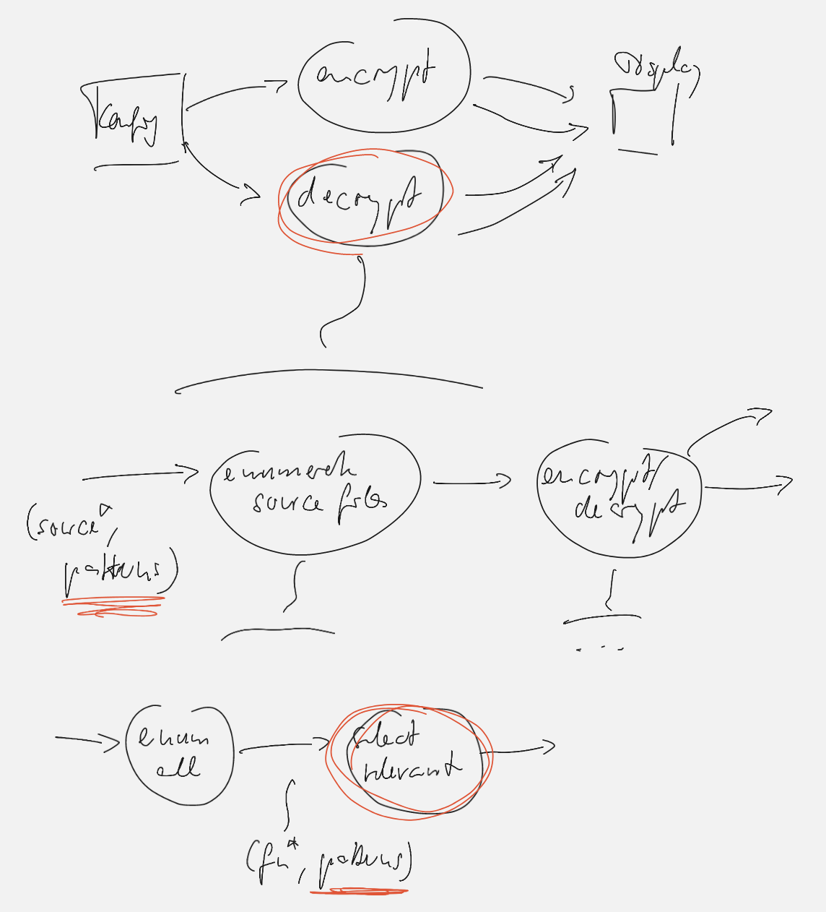

# ROT13 Encryptor
## Design
### Increment 1: Encrypt (ca. 20min)

### Inrement 2: Decrypt (ca. 10min)
Decrypting is the same as encrypting with ROT13 - except it processes different files. Encryption and decryption are symmetric as the INPUT-OUTPUT mapping demonstrates (see Analysis).

* Encryption: *.txt* and *.md* files
* Decryption: *.encrypted* files

