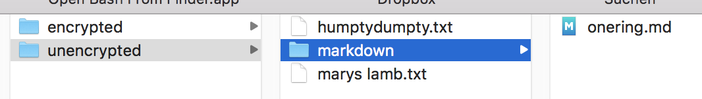
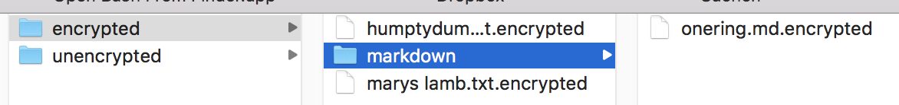

# ROT13 Encryptor
## Analysis
A program needs to be written. A console application.


Technologies are simple.

### ROT13
A simple mapping algorithm: a source character is mapped to/replaced by another character.


(from [Wikipedia](https://en.wikipedia.org/wiki/ROT13))

Both encryption and decryption map an *input* character to an *output* character in the above table. Example:

```
a.txt: Hello!

H->U
e->r
l->y
o->b

a.txt.encrypted: Uryyb!

U -> H
r -> e
y -> l
b -> o
```

Characters not found in the map are not en/decrypted, e.g. `CR`, `LF`, `TAB`, special characters like `.`, `!`. That means the basic structure of a source file is retained.

### Acceptance test
A much as possible should be tested automatically. Sample files are provided. They can be used as sources and gold masters for an acceptance test.





Function to test:


