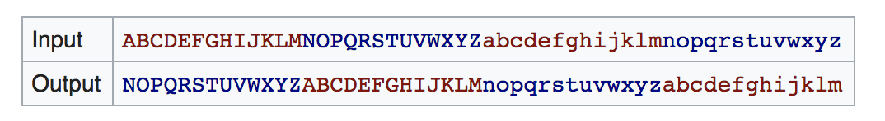

# ROT13 Encryptor
## Analysis
A program needs to be written. A console application.

Technologies are simple.

### ROT13
A simple mapping algorithm: a source character is mapped to/replaced by another character.

(from [Wikipedia](https://en.wikipedia.org/wiki/ROT13))

Encryption maps a character from Input to 